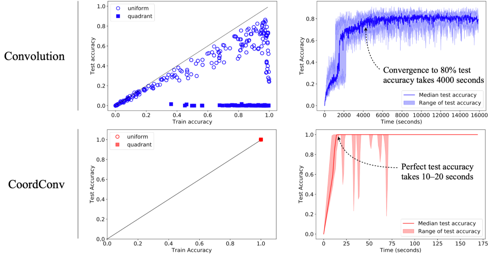

本記事はQrunchからの転載です。
___
CNNの表現能力の高さはすばらしいものがありますが、何でもうまくいくわけではありません。例えば、画像中の位置情報を考慮しないと解けないような問題は、通常のCNNではうまく対応できません（具体的な例はこの後説明します）。
このような問題に対応した手法としてCoordConvというものがあります。CoordConvは座標情報をCNNのなかに組み込む手法で、これを使うことで解けるようになるケースや性能が大きく改善されるようなケースがあります。また「効くか分からないけど、とりあえず組み込む」ということをしても、デメリットはそれほどありません。

今回はこのCoordConvの紹介です。

論文：[https://arxiv.org/pdf/1807.03247.pdf](https://arxiv.org/pdf/1807.03247.pdf)  
Keras実装：[https://github.com/titu1994/keras-coordconv](https://github.com/titu1994/keras-coordconv)  
PyTorch実装：[https://github.com/mkocabas/CoordConv-pytorch](https://github.com/mkocabas/CoordConv-pytorch)  
ちなみに、Keras実装は使ったことがありますが、いい感じに仕事してくれました。

# 通常のCNNだと解けない問題
## 解けない問題の紹介
以下の図は論文で示されている、通常のCNNではうまく解けない、あるいは性能が悪い問題設定です。
> 

* Supervised Coordinate Classification は2次元座標xとyを入力として2次元のグレイスケールの画像を出力する問題です。入力の(x,y)の座標に対応するピクセルだけが1、それ以外のところは0になるように出力します。出力されるピクセルの数の分類問題となります。
* Supervised Renderingも画像を出力しますが、入力(x,y)を中心とした9×9の四角に含まれるピクセルは1、それ以外は0になるように出力します。
* Unsupervised Density LearningはGANによって赤か青の四角と丸が書かれた画像を出力する問題となります。
* 上記の画像にはないのですが、Supervised Coordinate Classification の入力と出力を逆にした問題も論文では試されています。つまり、1ピクセルだけ1でそれ以外は0であるようなone hot encodingを入力として、1の値をもつピクセルの座標(x,y)を出力するような問題です。

## Supervised Coordinate Classificationを通常のCNNで学習させた結果
Supervised Coordinate Classificationを通常のCNNで学習させたときの結果を示します。

訓練データとテストデータの分け方で2種類の実験をおこなっています。
1つは取りうる座標全体からランダムに訓練データとテストデータに分けたケースです。もう一つは座標全体のうち、右下の部分をテストデータにし、それ以外を訓練データとするケースです。これをあらわしたのが、それぞれ以下の図のUniform splitとQuadrant splitになります。
> 
上記の2つのパターンでそれぞれ訓練データでCNNを訓練し、accuracyを計測した結果が以下の図になります。
> 

1つの点が1つの学習されたモデルでの訓練データとテストデータのaccuracyに対応しています（多分それぞれのモデルはハイパーパラメータが異なるのですが、はっきりと読み取れませんでした）。  
このグラフから、Uniform splitのときには訓練データのaccuracyは1.0になることがあっても、テストデータは高々0.86程度にしかならないことがわかります。また、Quadrant splitのときにはさらにひどい状況で、<u>テストデータはまったく正解しません</u>（ほとんど0ですね）。

問題設定を見ると、一見簡単な問題のように思えますが、実際には驚くほど解きにくい問題であることがわかります。

## Unsupervised Density Learningを通常のCNNで学習させた結果
次にGANのケースも見てみます。  
学習データでは青の図形と赤の図形はそれぞれ平面上に一様に分布します。下図の上段右がそれを示しており、赤の点と青の点がそれぞれの色の図形の中心位置をプロットしたものです。GANで生成する画像もこのように、図形が**一様に色々なところに描かれて欲しい**ところです。  
しかしながら、CNNを使ったGANのモデルが生成した画像では赤の図形と青の図形の位置の分布には偏りがあります（モード崩壊）。下図の下段右がこれを示しています。

# CoordConv
前述の問題はなぜ解きにくいのでしょうか。  
理由としては、CNNでは畳み込みの計算をおこなうだけであり、この畳み込みの計算では画像中のどこを畳み込んでいるのかは考慮できておらず、座標を考慮する必要がある問題がうまく解けないということが挙げられます。  
座標を考慮できていないから解けないならば、<u>畳み込むときに座標情報を付与すればよいのでは</u>、というのがCoordConvの発想です。

具体的には以下の右の層がCoordConvになります。

通常のCNNとの違いは、画像の各ピクセルのx軸の座標をあらわしたチャネル（i coordinate）とy軸の座標をあらわしたチャネル（j coordinate）を追加するということだけです。ただし、それぞれのチャネルの値は[-1,1]に正規化されています。

例えば、5×5の画像の場合では、x軸の座標をあらわしたチャネル（i coordinate）は以下のような行列になります。  
$$ {\rm (i \ coordinate)} = \begin{bmatrix} -1 & -0.5 & 0 & 0.5 & 1 \\\ -1 & -0.5 & 0 & 0.5 & 1 \\\ -1 & -0.5 & 0 & 0.5 & 1 \\\ -1 & -0.5 & 0 & 0.5 & 1 \\\ -1 & -0.5 & 0 & 0.5 & 1 \\\ \end{bmatrix} $$

また、y軸の座標をあらわしたチャネル（j coordinate）は以下のような行列になります。  
$${\rm (j \ coordinate)} =  \begin{bmatrix} -1 & -1 & -1 & -1 & -1 \\\ -0.5 & -0.5 & -0.5 & -0.5 & -0.5 \\\ 0 & 0 & 0 & 0 & 0 \\\ 0.5 & 0.5 & 0.5 & 0.5 & 0.5  \\\ 1 & 1 & 1 & 1 & 1  \\\ \end{bmatrix} $$

また、画像の中心からの距離をあらわしたチャネルを追加することでも性能が向上するようで、論文ではこちらも利用されています。

CoordConvによってすべてのCNNを代替すべきなのか、一部にしてもどこを置き換えるべきなのかは議論の余地があるかもしれませんが、例えばSupervised Coordinate Classificationの問題では、次の緑の部分にCoordConvが使われています。

ちなみにCoordConvの性能面に関して、論文中では以下の2点に関して言及されています。
* 追加されたチャネル分の畳み込みが増えるだけですので、それほど計算量は大きくなりません。
* CoordConvによる性能の悪影響があり得るんじゃないかと思えますが、そのような場合には重みが0に近づくように学習されるはずなので、予測結果に悪影響を与えないはず。

# CoordConvの効果
CoordConvの効果について実験結果を述べていきます。
## Supervised Coordinate Classificationの結果
Supervised Coordinate Classificationの結果が以下のようになります。

Convolutionの行が通常のCNNの場合、CoordConvの行がCoordConvを使った場合の結果です。  
CoordConvではデータの分割方法によらず、accuracyが1になり、非常にうまく問題が解けるようになります。また、収束性も非常によくなり、通常のCNNでは4000秒かかってテストデータのaccuracyが0.8を超えていますが、CoordConvでは20秒でaccuracyが1になっています。
## Unsupervised Density Learningの結果
GANの結果が以下のようになります。

3行目のCoordConvを導入したGANでは赤と青の図形の位置の偏りが緩和されていることがわかります。
ただしc列が2つの図形の中心座標の差を示しているのですが、これを見ると、残念ながらまだ分布に偏りがあるといえそうです。
## 強化学習の結果
論文では実際の問題にも適用して有効性を確認しています。
強化学習で使われているCNNをCoordConvに置き換えてatariのゲームを学習させています。結果は以下の通りです。

縦軸がゲームのスコアだと思いますが、9つのゲームのなかで、6つは性能が向上し、2つは変わらず、1つは悪くなった（理屈の上では悪影響がでないはずですが…？）という結果になりました。パックマンなど一部のゲームは非常に性能が良くなっていますね。

# 終わりに
CoordConvは問題によっては非常に有用です。座標を考慮したほうがが良いと思ったら、とりあえず利用するといいと思います。
既存のCNNをCoordConvに置き換えるのも簡単です！
