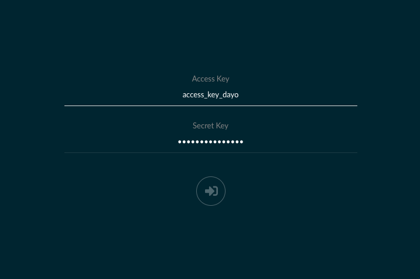

本記事はQrunchからの転載です。
___
AWSのS3を使うようなシステムを開発するときに、S3と連携する部分だけAWSにつなぐより、ローカルにS3が欲しいなぁってふと思いました。でもそんな都合が良い話があるわけないよなぁ、なんて思ったら実はありました！その名も**MinIO**。
今回はMinIOの使い方を簡単にご紹介します。とても簡単です。

MinIOのページはこちら。[https://min.io](https://min.io)

# 導入
自分はDockerを利用しましたので、Docker経由での使い方になります。
Dockerは嫌だという場合には公式のページをご確認下さい。[https://docs.min.io/](https://docs.min.io/)

1. Dockerをインストール。
Dockerを入れていない人はこの機会にぜひ入れましょう！今使っていなくとも、きっといつの日か別の機会にも使うんじゃないかと思います。インストールにはこの辺が参考になりそうです。[http://docs.docker.jp/engine/installation/docker-ce.html#](http://docs.docker.jp/engine/installation/docker-ce.html#)
1. ターミナル等で次を実行して、MinIOのサーバを立ち上げる。
```
docker run -p 9000:9000 \
--name minio_test \
-e "MINIO_ACCESS_KEY=access_key_dayo" \
-e "MINIO_SECRET_KEY=secret_key_dayo" \
minio/minio server /data
```
MINIO_ACCESS_KEYがAWSのアクセスキーで、MINIO_SECRET_KEYはシークレットキーに対応します。都合がよいように決めましょう。  
上のコマンドの初回実行時にはdocker imageのdownloadなどが走るのでちょっと時間がかかります。  
（Dockerを知らない人向け）アクセスするときにポートが9000は嫌だという人は、9000:9000の左側の数字を変えましょう。例えば8888:9000とかです。

実行がうまくいくと次のようなメッセージが表示されるかと思います。これでS3のようなものができました！すごく簡単  
http://127.0.0.1:9000 からMinIOのサーバにアクセスできるはずです。
```
Endpoint:  http://172.17.0.2:9000  http://127.0.0.1:9000

Browser Access:
   http://172.17.0.2:9000  http://127.0.0.1:9000

Object API (Amazon S3 compatible):
   Go:         https://docs.min.io/docs/golang-client-quickstart-guide
   Java:       https://docs.min.io/docs/java-client-quickstart-guide
   Python:     https://docs.min.io/docs/python-client-quickstart-guide
   JavaScript: https://docs.min.io/docs/javascript-client-quickstart-guide
   .NET:       https://docs.min.io/docs/dotnet-client-quickstart-guide
```

# 使ってみる
## ブラウザで利用
### アクセス
ブラウザで http://127.0.0.1:9000 にアクセスすると次のような画面が表示されます。  
Access KeyとSecret Keyはdocker runコマンドのときに指定した**MINIO_ACCESS_KEY**と**MINIO_SECRET_KEY**の値を入れましょう。これでログインできます。  


ログインすると以下のような画面になります。


### バケット生成
ここでAWSのS3のバケット相当のものが作れます。  
右下の+マークを押して、Create bucketを選択後、バケット名を入力すればOKです。この手順で、例えばtestという名前のバケットを作ると以下のようになります。

左側に生成したバケットが表示されていますね。

### ファイルを配置
画面の上のほうにファイルをドラッグするとこのバケット内にファイルが置けます。


## boto3で利用
boto3を使ってS3の操作をおこないます。Python3を例にあげます。
### S3と接続するためのオブジェクト生成
以下のclientの引数のaws_access_key_idとaws_secret_access_keyには、docker runしたときに設定した**MINIO_ACCESS_KEY**と**MINIO_SECRET_KEY**をそれぞれ指定しましょう。
```
import boto3
s3_client = boto3.client("s3", endpoint_url="http://127.0.0.1:9000",
                         aws_access_key_id="access_key_dayo",
                         aws_secret_access_key="secret_key_dayo")
```
### ファイル検索
ファイルの検索を試します。以下のように、作ったBucketを指定してやります。
```
contents = s3_client.list_objects(Bucket="test",
                                  Prefix="").get("Contents")
print(contents)
```
上記を実行すると、次のように表示されました。配置したファイルがちゃんと見つけられますね！
```
[{'Key': 'テキストたよ.txt', 'LastModified': datetime.datetime(2019, 11, 9, 3, 7, 27, 360000, tzinfo=tzutc()), 'ETag': '"59681d790d132065f97faf0f52e9aa41-1"', 'Size': 27, 'StorageClass': 'STANDARD', 'Owner': {'DisplayName': '', 'ID': '02d6176db174dc93cb1b899f7c6078f08654445fe8cf1b6ce98d8855f66bdbf4'}}]
```

### ファイル取得
ファイルの取得も試しましょう。以下を実行します。
```
text = s3_client.get_object(Bucket="test",
                            Key="テキストたよ.txt")["Body"].read().decode('utf-8')
print(text)
```
結果：
```
テキストの中身だよ
```
正しくテキストを取得できています！

# まとめ
MinIOはとても簡単に使えて、便利だと思いました。よくできていて感動しますね。
手元の環境にS3が欲しいなぁって思った方は使いましょう！
