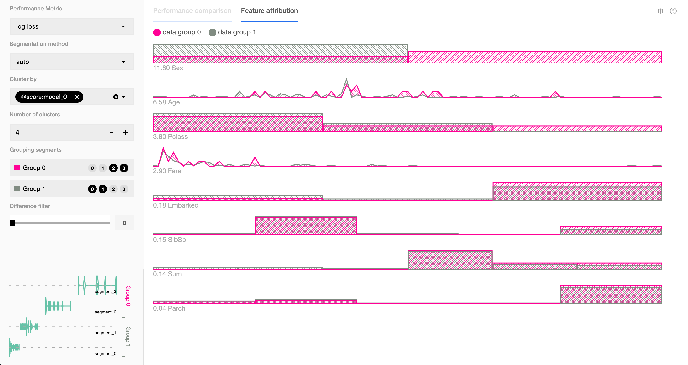
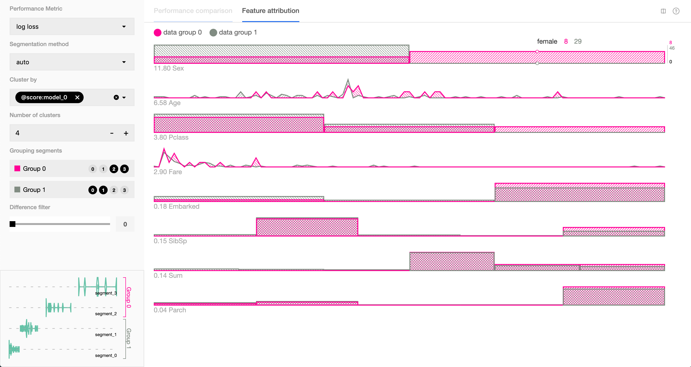

本記事はQrunchからの転載です。
___
Uberが公開している機械学習モデルの予測と特徴量の関係性を可視化するツールである[Manifold](https://github.com/uber/manifold#upload-csv-to-demo-app)を紹介します。

# Manifoldを試す
Manifoldでできることを見ていきます。

## インストール
レポジトリをgit cloneしてから、githubのページにあるように以下のようにしてインストールできました。

``` bash
# under the root directory, install all dependencies
yarn
# demo app is in examples/manifold directory
cd examples/manifold
# instal demo app dependencies
yarn
# start the app
npm run start
```

## 準備
まずユーザーは次の3つのデータを用意します。
1. 入力データの特徴量を記述したcsv
1. 入力データに対するラベル
1. 入力データに対するモデルの予測値（分類問題の場合には各クラスに属する確率になります）

モデルはなんでも良く、必要なのは予測値であることに注意してください。

今回はkaggleのタイタニックのデータから適当にテストデータを作ってみました。
テストデータとlightgbmのモデルを用いて、次のような感じでManifoldに必要なデータを作ってます。

```python
with open("./titanic_res/features.csv", "w") as f:
    columns = ",".join(list(X_test.columns)) # X_testがテストデータの特徴量
    f.write(f"{columns}\n")
    for i, features in X_test.iterrows():　
        f_string = ",".join([str(x) for x in features])
        f.write(f"{f_string}\n")

with open("./titanic_res/pred.csv", "w") as f:
    pred = bst.predict(X_test) # bstがlightgbmのモデル
    f.write("survived,death\n")
    for prob in pred:
        f.write(f"{prob},{1-prob}\n")        
        
with open("./titanic_res/truth.csv", "w") as f:
    f.write("truth\n")
    for truth in y_test: # y_testがテストデータのラベル
        label = "survived" if truth == 1 else "death"
        f.write(f"{label}\n")
```

## Manifoldでの可視化
### アップロード
npm run startを実行すると、ブラウザ上でアプリが立ち上がります。
立ち上げ直後はファイルのアップロードを促されるので、準備したファイルをドラッグアンドドロップしてアップロードします。


### 性能の分布
アップロードすると、次のような画面になります。


Manifoldでは**予測値の当たり具合によって**、自動で各データがsegmentに分けられています。
各segmentはlog lossの値をK-meansに適用することでできたクラスタになっています。

グラフの横軸がlog lossとなっており、segmentにわけてデータの個数が描画されています。
segment0に含まれるデータは性能が良く、segment3に含まれるデータは性能が悪いという見方になります。  
また各segmentはGroup0かGroup1に振り分けられます。Group0が性能が悪く、Group1が性能が良いです。  
各segmentがどのGroupに入るのかはユーザー側で変えることが可能です。

### 特徴量の分布
ManifoldではGroup毎の特徴量の分布の違いを見ることができます。


一番上の行がGroupによる性別の分布の違いをあらわしたもので、そこにマウスをもってくると次のようになります。


性別が男性である場合にはGroup1に入っている（性能が良い）データが46個、Group0に入っている（性能が悪い）データが7個となっています。
また、マウスを右側にもっていくと次のようになります。


これによると、性別が女性である場合にはGroup1に入っている（性能が良い）データは29個、Group0に入っている（性能が悪い）データは8個となっています。
よって、女性のほうが予測が上手くいっていないことになります。
タイタニック号に乗っていた女性は男性よりも優先されて救命ボートに乗っていました。男性である場合にはほぼボートに乗れず、そのような人たちは生き残らないため、予測が容易という解釈になるのかなと思います。  
一方で女性のなかでもボートに乗れるかどうかは他の要素によって左右されるため、予測が男性に比べると難しいという解釈かと思います。

今は一番上が性別、2行目が年齢となっています。この並びの順番ですが、KL-divergenceによって求められた「2つのGroupでの特徴量の分布」が**違う順**になっています。
下にいくほどGroup間での違いがない特徴量であることを示します。

### どう使うべきか？
Manifoldで出来ることは、予測が上手くいっていないデータの傾向を可視化することです。
どうしてモデルの予測が上手くいっていないのかを説明すること、またモデルを改善することに役立てることができるのではないかと思います。
