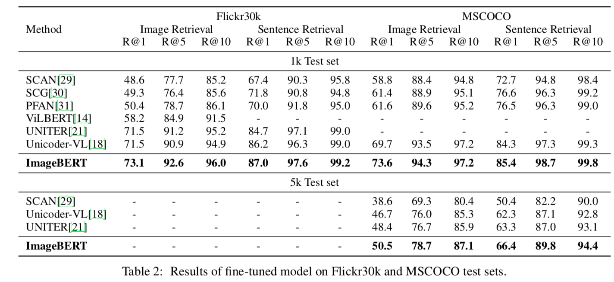
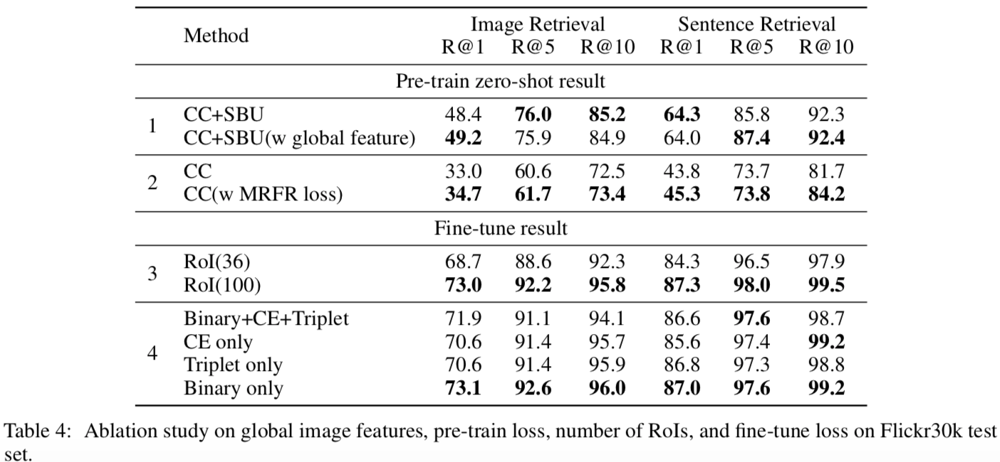

最近Microsoftから発表されたImageBERTについて紹介します。  
ImageBERTはBERTの入力に自然言語だけではなく、画像も受け付けるようにしたマルチモーダルなモデルです。
また論文ではモデルのアーキテクチャだけではなく、学習方法にも新たな提案がされています。  
実験ではImage-to-Sentenceでの検索とSentence-to-Imageの検索タスクでSOTAが示されています。

論文：[ImageBERT: Cross-modal Pre-training with Large-scale Weak-supervised Image-Text Data](https://arxiv.org/abs/2001.07966)

# アーキテクチャ
ImageBERTのアーキテクチャは以下のとおりです。

テキストの入力と画像の入力で分けて説明します。
なお、論文中では画像のcaptioningのデータセットを用いています。

## テキストの入力
テキストは通常のBERTのようにsubwordに分割して、それらのembeddingを入力します。
BERTでは2つの文を与えるときに、1つ目の文か2つ目の文かを識別する情報をsubwordのembeddingに加えますが、ImageBERTでも同じように画像か文かを識別する情報を加えます。図でいうところのSegment Embeddingになります。  
また、文の位置情報もBERTやTransformerでは与える必要があり、ImageBERTでも位置情報を加えます。しかし、ここではtokenの順番を昇順に与えるというシンプルなやり方のようです。これは図中のSequence Position Embeddingになります。

## 画像の入力
画像はそのままモデルに入力するのではなく、FasterRCNNで物体検出をして、検出された箇所の特徴量をそれぞれ入力する形になります（画像の特徴量はsubwordのembeddingと同じ次元に射影します）。  
テキストの場合と同じようにSegment EmbeddingとSequence Position Embeddingも与えるのですが、Sequence Position Embeddingはテキストの場合とは与え方が異なります。テキストの場合にはsubwordに順序がありましたが、画像中の物体には順序がありませんので、すべて同じSequence Position Embeddingを与えます。

また、これら以外にPosition Embeddingというものも与えます。Position Emebeddingは以下で与えられるベクトルをsubwordのembeddingと同じ次元に射影したものです。
$$ c = \begin{pmatrix} \frac{x_{tl}}{W}, \frac{y_{tl}}{H}, \frac{x_{br}}{W}, \frac{y_{br}}{H}, \frac{(x_{br} - x_{tl}) (y_{br} - y_{tl}) }{WH} \end{pmatrix}.$$
ここで、$x_{tl}, y_{tl},  x_{br}, y_{br}$はそれぞれ物体の左上の$x$と$y$、右下の$x$と$y$座標になります。$W$と$H$は入力画像の横と縦の大きさです。
つまり、$c$は物体の位置と面積の割合の情報になります。

# 事前学習のタスク
ImageBERTでは事前学習に次の4つタスクを解きます。
1. Masked Language Modeling (MLM)
これは通常のBERTと同じように、入力されるsubwordをランダムにマスクし、マスクされた単語を予測するようなタスクです。
1. Masked Object Classification (MOC)
これはMLMの画像版のタスクです。検出された物体をランダムにマスクし、マスクされた物体のラベルを予測するようなタスクです。正解ラベルはFaster-RCNNで求まったラベルとしています。
1. Masked Region Feature Regression (MRFR)
MOCはラベルを予測するようなタスクですが、MRFRはマスクされた物体の箇所の特徴量を予測するタスクです。
1. Image-Text Matching (ITM)
入力テキストと画像が対応しているかを予測するタスクです。ランダムに画像を選ぶことで、対応していないテキストと画像のペアを作っています。

# マルチステージの事前学習
ImageBERTでは事前学習をデータセット単位で別々におこないます。実験結果で書かれていますが、別々にすることで性能が大きく変わります。
以下の図のように最初にLarge-Scale Weak-supervised Image-Text Data（これは次に説明します）
で事前学習をし、その次にConceptual CaptionsとSBU Captionsのデータセットで事前学習をします。最後にfinetuningをおこないます。

# Large-Scale Weak-supervised Image-Text
大量の画像とテキストのペアをweb上からクローリングして、事前学習に使っています。
論文中では画像とテキストのペアが10M個あるこのデータセットをLAIT (Large-scale weAk-supervised Image-Text) と読んでいます。

LAITでは、webページ上の画像とHTMLのALTあるいはTITLEタグのテキストをcaptionとして対応付けています。単純にこれらを取得してくると、当然ノイジーなデータが多く含まれることになります。例えば、言語が英語ではない、画像のサイズが小さすぎる、現実の画像ではないなどが該当します。このようなペアをルールベースあるいは機械学習のモデルを用いてフィルタリングしています。  
一連の流れは以下のようになります。

# 実験
## 準備
事前学習したImageBERTはMSCOCOとFlickr30kを用いてfinetuningしています。  
finetuningするさいはITMのように、入力されたテキストと画像がペアであるかを正しく予測できるように学習していきます。事前学習でのITMに用いた出力のtokenを射影してfinetuningします。

## 結果
### 性能比較
以下の表は他手法との性能の比較です。

Image Retrievalは与えられたテキストと対応づく画像を検索するタスク、Sentence Retrievalは与えられた画像から対応づくテキストを検索するタスクです。それぞれRecallで評価されています。

他手法と比べて、ImageBERTは性能が良いことがわかります。全体傾向として、Sentence Retrievalは性能が高いですね。

### マルチステージの効果
以下の表がマルチステージの学習の効果をあらわしています。

上4つがそれぞれのデータセットのみで学習した場合、一番下がLAITで事前学習したあとにConceptual CaptionsとSBU Captionsで学習した場合の結果になります。  
明らかにマルチステージで学習することに優位性がありますね。この結果はImageBERTに限らず参考になりそうです。

### ablation study
ablation studyです。

それぞれ次を意味しています。
1. 画像全体の特徴量もImageBERTに与えるケースで性能が変わるかを示しています。どちらが良い性能化は一概にいえない結果になっています。
1.  MRFRの有無で性能が変わるかを示しています。すべてのケースでMRFRを解いたほうが良い性能になっています。
1.  Faster-RCNNで検出された物体を最大いくつ入力するかをあらわしています。最大36個与えるときより最大100個としたときのほうが高い性能になっています。
1.  finetuningのロスとしてどれがいいかを示しています。Binaryは正しいテキストと画像のペアか否かの2分類をBinary Cross Entropyを使って解いたケースをあらわします。2分類問題として解くのが一番良い性能になっています。理由はちょっとわかりません。

# まとめ
マルチモーダルのモデルであるImageBERTを紹介しました。  
事前学習したモデルが公開されていれば色々試したいですが、自分で1から学習する気にはなかなかなりませんね。  
ImageBERTの事前学習モデルが公開されれば、以前公開した[記事](https://qrunch.net/@opqrstuvcut/entries/O37ZGE1YhN5or3Oi)と同じ要領で画像からcaptionを生成できるんじゃないかなと思ってます。
